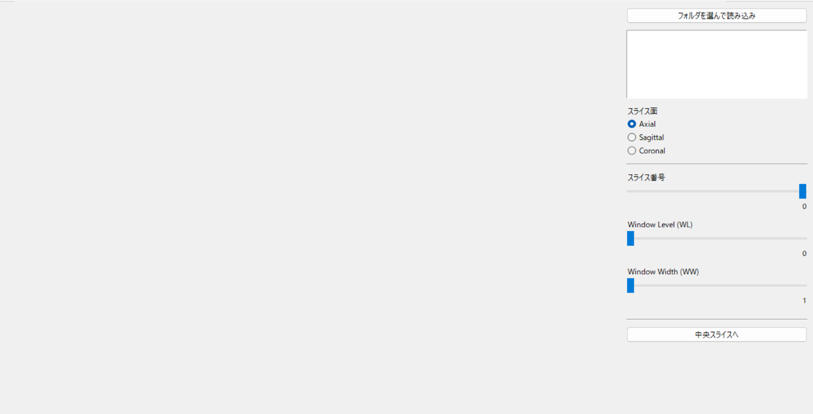
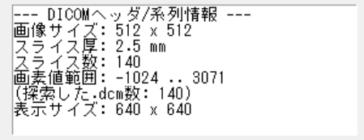
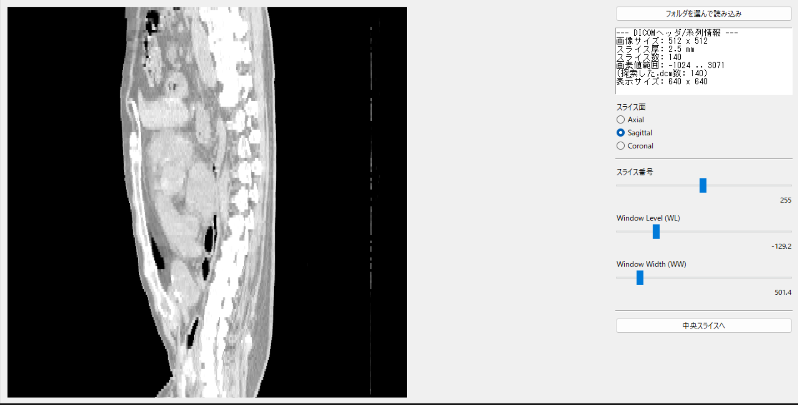
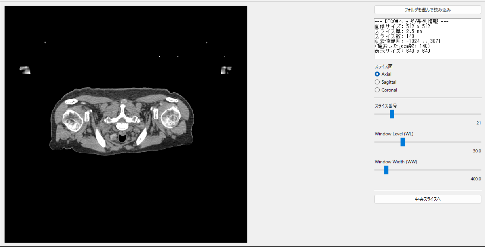

# dicom-viewer
CT DICOM image series viewer (Medical Image Processing Experiment)
# CT画像系列 Viewer 操作マニュアル  
（知能情報実験実習2 医用画像処理実験 最終課題）

大阪公立大学工業高等専門学校  
知能情報コース 4年  
医用画像処理実験

---

## 1. 概要

本Viewerは、CT画像のDICOM画像系列データを読み込み，
スライス画像の表示やWindow Width / Window Levelの変更，
断面（Axial / Sagittal / Coronal）の切り替えを行う
画像系列Viewerである。

Pythonと標準GUIライブラリ（tkinter）を用いて実装しており，
特別な実行環境を必要としない。

---

## 2. 動作環境

- OS：Windows 10 / 11
- Python：3.10以上
- 使用ライブラリ
  - pydicom
  - numpy
  - pillow
  - tkinter（標準ライブラリ）

---

## 3. 起動方法

### 3.1 プログラムの実行

ターミナルまたはVS Codeで以下を実行する。

起動するとViewerのウィンドウが表示される。

---

## 4. CT画像データの読み込み方法

1. Viewer上部の「フォルダを選んで読み込み」ボタンを押す
2. .dcmファイルが格納されているフォルダを選択する  
   ※ ファイルではなくフォルダを選択する点に注意する

正しく読み込まれるとCT画像が表示される。

---

## 5. 画面構成

### 5.1 画像表示領域（左側）

- CT画像が表示される
- 表示サイズは固定されており，操作によって拡大・縮小は行われない

### 5.2 操作パネル（右側）

- DICOMヘッダ情報の表示
- スライス面の選択
- スライス番号スライダ
- Window Level / Window Width スライダ

---

## 6. DICOMヘッダ情報の表示

右側の情報表示欄には，DICOMヘッダから取得した以下の情報を表示する。

- 画像の縦・横サイズ
- スライス厚
- スライス数
- 画素値の最小値・最大値

---

## 7. スライス面の切り替え

スライス面選択ボタンにより，以下の断面を切り替えて表示できる。

- Axial（原画像）
- Sagittal
- Coronal

Axial画像は原画像として常に表示可能である。

  
  

---

## 8. スライス番号の変更

スライス番号スライダを操作することで，
表示するスライス画像を変更できる。

現在のスライス番号は数値として表示される。

---

## 9. Window Level / Window Width の変更

### 9.1 Window Level（WL）

表示する画素値の中心を変更し，
画像の明るさを調整する。

### 9.2 Window Width（WW）

表示する画素値の幅を変更し，
画像のコントラストを調整する。

スライダ操作により，
16bit画像を8bit画像（0～255）に変換して表示する。

---

## 10. 実装上の工夫

- CT画像は16bit画像であるため，
  Window Level / Window Widthを用いて8bitに変換して表示している
- 再描画時の表示不具合を防ぐため，
  表示画像サイズを固定値として管理している
- DICOMヘッダ情報を用いて，
  スライス順を正しく並べ替えている

---

## 11. GitHubについて

本リポジトリにはViewerのプログラムソースのみを配置している。  
CTのDICOM画像データはGitHubには含めていない。

---

## 12. まとめ

本Viewerにより，CT画像系列データを直感的に操作・観察することが可能となった。  
医用画像処理における基本的なViewer機能を実装し，
DICOMデータ構造への理解を深めることができた。

